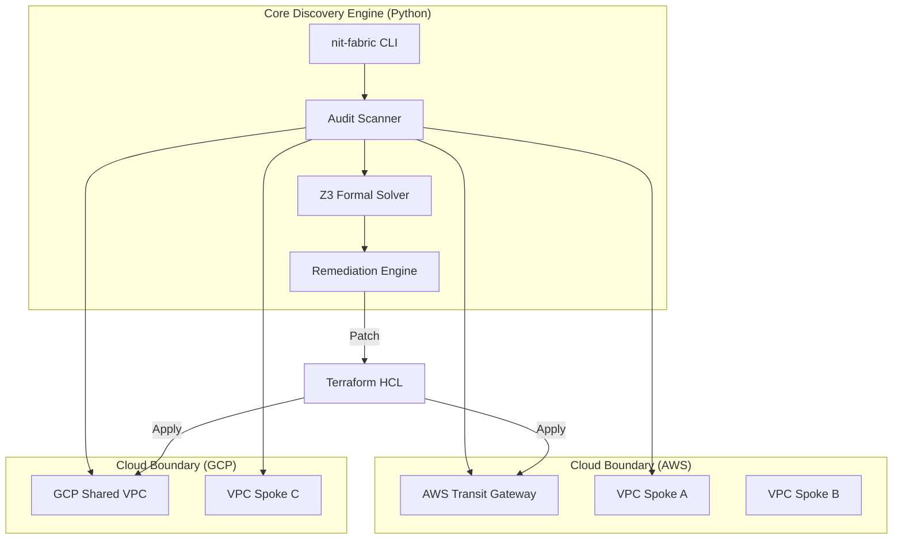

# nit-fabric | Multi-Cloud Network Auditor
*Automated Network Assurance, IPAM, and Security Drift Enforcement*

**Status**: Shipped | **Architecture**: Modular Cloud Connectivity | **Verification**: Z3-Backed Formal Solving

A tool for auditing and fixing connectivity issues across AWS and GCP. It helps prevent CIDR overlaps and ensures security best practices are followed.

## 1. The Architectural Topology

The **nit-fabric** is an industrial-grade multi-cloud connectivity engine designed to automate the auditing, discovery, and remediation of complex VPC and BGP network topologies across AWS and GCP.



## 2. Features
- **CIDR Validation**: Prevents overlapping IP ranges across clouds via Z3-backed formal verification.
- **Discovery**: Queries AWS/GCP APIs to detect "out-of-band" changes and drift.
- **Remediation**: Generates type-safe HCL or shell scripts to fix findings.
- **Advisor Mode**: Explains misconfigurations and manual remediation paths.
- **Security Checks**: Audits S3 buckets, GKE clusters, and Firewall rules.

## 3. Quick Start

---

2. **Run a scan**:
   ```bash
   # Make sure you have aws/gcloud credentials configured
   PYTHONPATH=src python3 src/nit_fabric/main.py scan --mode cli
   ```

3. **Generate a fix**:
   ```bash
   PYTHONPATH=src python3 src/nit_fabric/main.py remediate --provider terraform
   ```

This engine operates in high-security environments where network misconfigurations represent systemic failure risks.

### Systemic Constraints & SLOs
- **Blast Radius Isolation**: Remediations scoped strictly to misconfigurations; 100% decoupling from factory root.
- **Formal Verification**: IPAM/CIDR disjointness verified via **Z3 SMT Solver** (O(k) complexity).
- **Supply-Chain Sovereignty**: 100% **OIDC Passwordless Authentication** and **SHA-pinned** workflows.
- **Discovery Accuracy**: Target 100% precision in identifying "Ghost Dependencies" and "Silent Discovery Failures".

---

## 4. Troubleshooting & Documentation Links
For deep architectural details, consult the specialized documents:
* **System Overview & Trade-offs**: [docs/ARCHITECTURE.md](docs/ARCHITECTURE.md)
* **BGP, Routing, & IPAM Math**: [docs/NETWORKING.md](docs/NETWORKING.md)
* **Zero-Trust Guardrails & Security Policies**: [docs/SECURITY.md](docs/SECURITY.md)
* **Runbooks & Credentials**: [docs/OPERATIONS.md](docs/OPERATIONS.md)
* **Developer Guide & Code Tour**: [docs/DEVELOPER_GUIDE.md](docs/DEVELOPER_GUIDE.md)

## 5. Architecture Trade-Off Matrix

| Architectural Path | Chosen? | Trade-Off Accepted | Mitigation Strategy |
|---|---|---|---|
| **Z3-Backed Solver** | **Yes** | Increased computational overhead for complex CIDR meshes. | Optimized radix trie algorithms and threading locks. |
| **Modular HCL Sprouting** | **Yes** | Requires pre-existing provider-specific VPC modules. | Standardized industrial hub-and-spoke HCL blueprints. |
| **CLI-First Discovery** | **Yes** | Slower than native SDK calls in high-volume scenarios. | Parallelized discovery threads and caching layers. |
| **Type-Safe HCL Gen** | **Yes** | More complex implementation than simple Jinja2 templates. | Eliminated risk of malformed HCL generation. |

## 6. Networking Best Practices & Design

- **Discovery Layer**: Uses AWS/GCP CLIs to fetch current state, detecting drift from Terraform state.
- **Policy Engine**: Deterministic rules-based engine evaluating `context.json` against `policies.yaml`.
- **BGP Peering**: Uses BGP with private ASNs (**AWS: 64512**, **GCP: 64600**) for all cross-cloud links.
- **MTU 1440**: Tunnels standardized at 1440 MTU to avoid packet fragmentation.
- **Route Summarization**: Advertises aggregate blocks (e.g., /16) to keep routing tables manageable.

## 7. Troubleshooting Common Issues

| Issue | Likely Cause | Fix |
| :--- | :--- | :--- |
| BGP Session Down | ASN Mismatch | Run `remediate --explain` to check ASNs (Target: AWS 64512 / GCP 64600). |
| Packet Loss | MTU Issues | Ensure tunnel MTU is set to 1440. |
| CIDR Conflict | Overlapping Subnets | Check `violations.json` for Z3 proof output. |
| Discovery Failure | Auth Error | Run `aws sts get-caller-identity` or `gcloud auth list` to check credentials. |

## 8. Technical Primitives
- **`src/nit_fabric/main.py`**: Central orchestration entry point.
- **`src/nit_fabric/preflight.py`**: Deterministic pre-flight dependency and auth verification.
- **`terraform/modules/`**: High-resolution reusable hub-and-spoke modules.
- **`.agent/policies/`**: OPA Rego governance rules for network security.

## TODO / Known Issues
- [x] GCP discovery: Enhanced with high-resolution peerings and Cloud Asset inventory scans.
- [x] Performance: Z3 SMT Solver for ultra-fast CIDR containment proofs.
- [ ] Add support for Azure (long term).

## SRE & Operations
This project adheres to the **Agentic SRE Protocol**. See `runbooks/` for incident response guides and `terraform/sre-monitoring.tf` for Golden Signals.
Adheres to **ACS 2026** standards. The physical sovereignty hub in `.agent/` is the immutable truth for all specialist maintenance.
