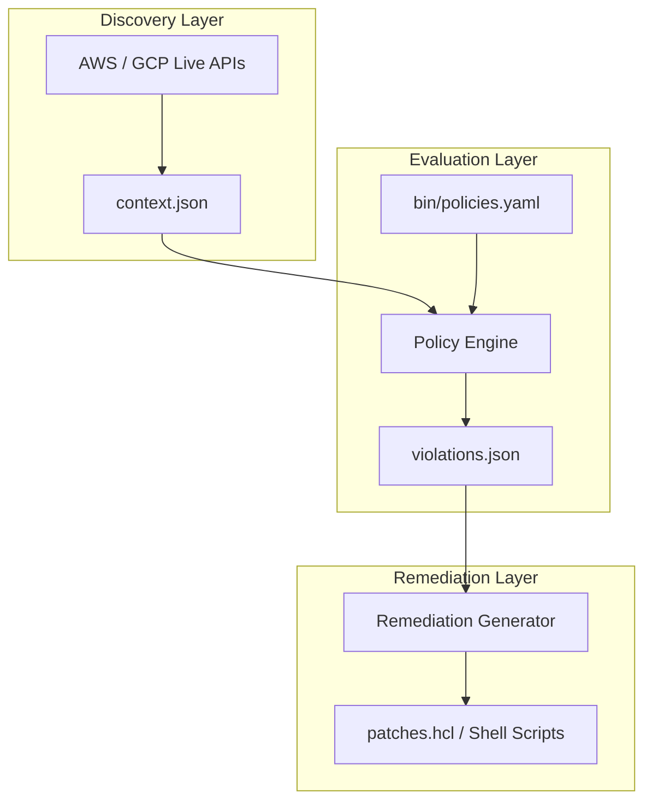

# Multi-Cloud Network Auditor | System Architecture Design
*High-Level Overview, Trade-Offs, and Core System Goals*

---

## 1. System Goals & Problem Space
As enterprise platforms expand across Amazon Web Services (AWS) and Google Cloud Platform (GCP), managing network routing and resource alignment becomes complex. Out-of-band updates, manual emergency interventions, and decentralized administrative access inevitably lead to configuration drift.

`nit-fabric` is designed to enforce three core goals:
1. **Network Collision Avoidance**: Programmatically ensuring multi-cloud sub-networks are completely disjoint before cross-cloud routing tunnels are provisioned.
2. **Deterministic Compliance Verification**: Translating infrastructure security postures (such as open firewalls, unprotected object storage, and insecure identity profiles) into clean, auditable metrics.
3. **Automated Remediation Output**: Generating safe, version-controlled Terraform (HCL) patches or command-line patches directly from discovered states.

---

## 2. High-Level Architecture Overview
`nit-fabric` separates the multi-cloud audit lifecycle into three decoupled logical layers:

1. **Discovery Layer (The Live Truth)**: Queries active AWS and GCP APIs directly, bypassing Terraform states to capture manual drift. The resulting infrastructure mapping is serialized to a standard `context.json`.
2. **Evaluation Layer (The Decoupled Rules Engine)**: Validates `context.json` against defined policies. It generates `violations.json` along with structured advice.
3. **Remediation Layer (Deterministic Fixes)**: Consumes the violations report to output remediation scripts or infrastructure patches.

---

## 3. Critical Engineering Concerns & Trade-offs

### 3.1 Live API Discovery vs. Static IaC Scanning
* **Live Discovery (Selected)**: Querying live cloud provider endpoints detects out-of-band updates, manual emergency modifications, and drift.
* **Trade-off & Mitigation**: Requires active, high-privilege credentials during execution, introducing external API rate-limiting issues and dependency on active network paths to cloud backends.

> [!WARNING]
> **Drift Reconciliation Loop**: Applying patches directly generated from live discoveries can conflict with your existing static Terraform code, causing pipeline rollbacks on the next IaC run. To reconcile this, any patch generated by `nit-fabric` **must first be committed back to the Git repository** as an IaC modification before deployment, rather than being applied directly as an out-of-band fix.

### 3.2 Rules-Based Engine vs. LLM Assessment
* **Rules-Based Engine (Selected)**: The Policy Engine evaluates CIDRs mathematically and checks configurations strictly using rules-based validation.
* **Trade-off**: Higher up-front engineering investment to define exact checks. However, this is necessary because multi-cloud routing requires absolute predictability.
* **Deterministic Patch Generation**: The remediator does not use generative LLMs to synthesize code. It injects values into static, pre-audited Jinja2 templates (`bin/templates/`) to guarantee that the generated HCL and shell patches are 100% predictable and syntax-valid.

### 3.3 Offline State Encryption
* **Encrypted Backend**: All configuration state caches are locked into secure, encrypted remote state backends (S3 with KMS CMKs and DynamoDB locks).
* **Trade-off**: Requires additional initial resources to configure and manage keys, but ensures no configuration exposures leak cross-cloud topology details.

For detailed analysis on specific domains, please consult:
* **Networking & Routing Design**: [NETWORKING.md](NETWORKING.md)
* **Security Specifications**: [SECURITY.md](SECURITY.md)
* **Operations Guide & Runbooks**: [OPERATIONS.md](OPERATIONS.md)
